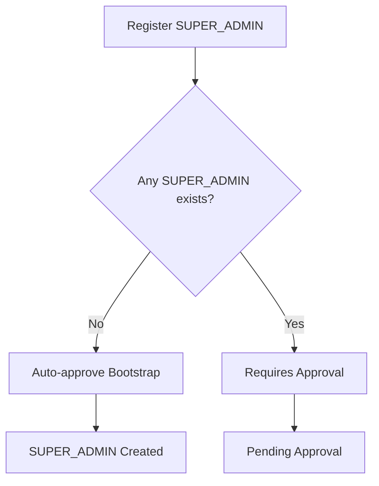
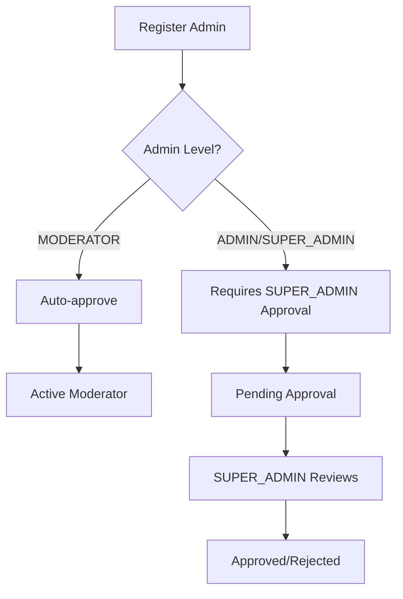

# LOOOP Admin System Documentation

## Overview

The LOOOP Admin System provides hierarchical administrative access with role-based permissions. It addresses the bootstrap problem where no admin exists to approve the first admin.

## Admin Hierarchy

### 1. MODERATOR
- **Auto-approved** during registration
- **Permissions**: Content moderation, basic analytics
- **Use case**: Community managers, content reviewers

### 2. ADMIN
- **Requires approval** from SUPER_ADMIN
- **Permissions**: User management, artist claim approval, playlist creation
- **Use case**: Platform administrators

### 3. SUPER_ADMIN
- **Requires approval** from existing SUPER_ADMIN
- **Special case**: First SUPER_ADMIN is auto-approved (bootstrap)
- **Permissions**: Full system access, admin management
- **Use case**: System administrators

## Bootstrap Problem & Solution

### The Problem
- SUPER_ADMIN approval is required for ADMIN/SUPER_ADMIN registrations
- If no SUPER_ADMIN exists, no one can approve admin registrations
- This creates a "chicken and egg" problem

### The Solution

#### 1. Automatic Bootstrap Detection
The system automatically detects when no SUPER_ADMIN exists and:
- Auto-approves the first SUPER_ADMIN registration
- Logs the bootstrap event
- Sets `adminApprovedBy` to "SYSTEM_BOOTSTRAP"

#### 2. Bootstrap Script
```bash
# Run the bootstrap script
pnpm run admin:bootstrap
```

The script:
- Checks if bootstrap is needed
- Creates first SUPER_ADMIN from environment variables
- Provides status feedback

#### 3. Environment Variables
```env
BOOTSTRAP_ADMIN_NAME="LOOOP Super Admin"
BOOTSTRAP_ADMIN_EMAIL="admin@looopmusic.com"
BOOTSTRAP_ADMIN_PASSWORD="SecurePassword123!"
```

## API Endpoints

### Public Endpoints

#### Check Bootstrap Status
```
GET /api/v1/admin/bootstrap/status
```
**Response:**
```json
{
  "success": true,
  "data": {
    "isBootstrapNeeded": false,
    "superAdminCount": 1,
    "message": "SUPER_ADMIN exists. System is ready.",
    "recommendation": "System is properly configured"
  }
}
```

#### Register Admin
```
POST /api/v1/admin/register
```
**Body:**
```json
{
  "name": "Admin Name",
  "email": "admin@looopmusic.com",
  "password": "SecurePassword123!",
  "adminLevel": "SUPER_ADMIN",
  "justification": "First admin setup"
}
```

### Protected Endpoints (Require Admin Auth)

#### Get Admin Profile
```
GET /api/v1/admin/profile
Authorization: Bearer <token>
```

#### Dashboard Stats
```
GET /api/v1/admin/dashboard/stats
Authorization: Bearer <token>
```

#### Manage Admins (SUPER_ADMIN only)
```
GET /api/v1/admin/admins
GET /api/v1/admin/admins/pending
POST /api/v1/admin/admins/:userId/approve
PUT /api/v1/admin/admins/:userId/permissions
```

## Admin Registration Flow

### 1. First Admin (Bootstrap)


### 2. Subsequent Admins


## Permissions System

### Permission Categories

#### Content Management
- `canModerateContent`: Moderate user-generated content
- `canDeleteContent`: Delete inappropriate content

#### User Management
- `canManageUsers`: View and manage user accounts
- `canBanUsers`: Ban problematic users

#### Artist Management
- `canApproveArtistClaims`: Approve artist verification requests

#### Platform Management
- `canCreatePlaylists`: Create featured/admin playlists
- `canViewAnalytics`: Access platform analytics
- `canManageSystem`: System configuration access

#### Admin Management (SUPER_ADMIN only)
- `canManageAdmins`: Approve/manage other admins
- `canManagePayments`: Payment system access

### Default Permissions by Level

```typescript
const DEFAULT_ADMIN_PERMISSIONS = {
  MODERATOR: [
    'canModerateContent',
    'canViewAnalytics'
  ],
  ADMIN: [
    'canApproveArtistClaims',
    'canManageUsers',
    'canCreatePlaylists',
    'canModerateContent',
    'canViewAnalytics',
    'canDeleteContent'
  ],
  SUPER_ADMIN: [
    'canApproveArtistClaims',
    'canManageUsers',
    'canCreatePlaylists',
    'canModerateContent',
    'canManageAdmins',
    'canViewAnalytics',
    'canManageSystem',
    'canDeleteContent',
    'canBanUsers',
    'canManagePayments'
  ]
};
```

## Security Features

### 1. Domain Validation
- Only `@looopmusic.com` emails can register as admins
- Enforced at middleware level

### 2. Role-based Access Control
- Endpoints protected by required permissions
- Hierarchical access (SUPER_ADMIN > ADMIN > MODERATOR)

### 3. Audit Logging
- All admin actions are logged
- Includes approval history and permission changes

### 4. JWT Authentication
- Secure token-based authentication
- Admin-specific middleware validation

## Setup Instructions

### 1. Initial Setup
```bash
# Clone and install
npm install

# Set up environment variables
cp .env.example .env
# Edit .env with your configuration

# Run database migrations
npm run db:migrate

# Check if bootstrap is needed
curl http://localhost:5000/api/v1/admin/bootstrap/status
```

### 2. Bootstrap First Admin
```bash
# Method 1: Using script
npm run admin:bootstrap

# Method 2: Using API
curl -X POST http://localhost:5000/api/v1/admin/register \
  -H "Content-Type: application/json" \
  -d '{
    "name": "Super Admin",
    "email": "admin@looopmusic.com",
    "password": "SecurePassword123!",
    "adminLevel": "SUPER_ADMIN"
  }'
```

### 3. Login as Admin
```bash
# Login to get token
curl -X POST http://localhost:5000/api/v1/auth/login \
  -H "Content-Type: application/json" \
  -d '{
    "email": "admin@looopmusic.com",
    "password": "SecurePassword123!"
  }'

# Use token for admin endpoints
curl -X GET http://localhost:5000/api/v1/admin/profile \
  -H "Authorization: Bearer <your-token>"
```

## Troubleshooting

### Bootstrap Issues

#### Problem: "Bootstrap not needed" but no admin access
**Solution:** Check if user exists but isn't properly configured
```bash
# Check user status
curl http://localhost:5000/api/v1/admin/bootstrap/status

# Re-run bootstrap script
npm run admin:bootstrap
```

#### Problem: Domain validation failure
**Solution:** Ensure email ends with `@looopmusic.com`
```bash
# Check environment variable
echo $BOOTSTRAP_ADMIN_EMAIL

# Update if needed
export BOOTSTRAP_ADMIN_EMAIL="admin@looopmusic.com"
```

### Permission Issues

#### Problem: Access denied for admin actions
**Solution:** Check admin level and permissions
```bash
# Get admin profile
curl -X GET http://localhost:5000/api/v1/admin/profile \
  -H "Authorization: Bearer <token>"

# Check required permission for endpoint
```

#### Problem: Cannot approve other admins
**Solution:** Only SUPER_ADMIN can approve other admins
```bash
# Verify you are SUPER_ADMIN
curl -X GET http://localhost:5000/api/v1/admin/profile \
  -H "Authorization: Bearer <token>"
```

## Development Notes

### Adding New Permissions
1. Add permission to `types/admin.types.ts`
2. Update `DEFAULT_ADMIN_PERMISSIONS`
3. Add middleware validation
4. Update documentation

### Creating Admin Endpoints
```typescript
// Use appropriate middleware
router.post('/admin-action',
  requireAuth,
  adminWithPermission('canDoAction'),
  asyncHandler(controllerFunction)
);
```

### Testing Admin Features
```bash
# Run tests
npm test

# Manual testing with different admin levels
# Create test admins with different levels
# Test permission enforcement
```

## Migration Guide

### From No Admin System
1. Run bootstrap script
2. Create initial SUPER_ADMIN
3. Register additional admins as needed
4. Configure permissions

### From Basic Admin System
1. Update user roles in database
2. Set appropriate admin levels
3. Assign default permissions
4. Test access controls

## Monitoring

### Key Metrics
- Number of active admins by level
- Failed admin access attempts
- Permission usage patterns
- Bootstrap events

### Logging
- All admin registrations
- Approval/rejection events
- Permission changes
- Security violations

### Alerts
- Multiple failed admin logins
- Privilege escalation attempts
- Unauthorized domain registrations
- System bootstrap events
